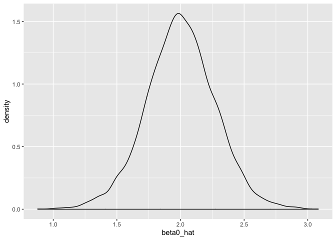
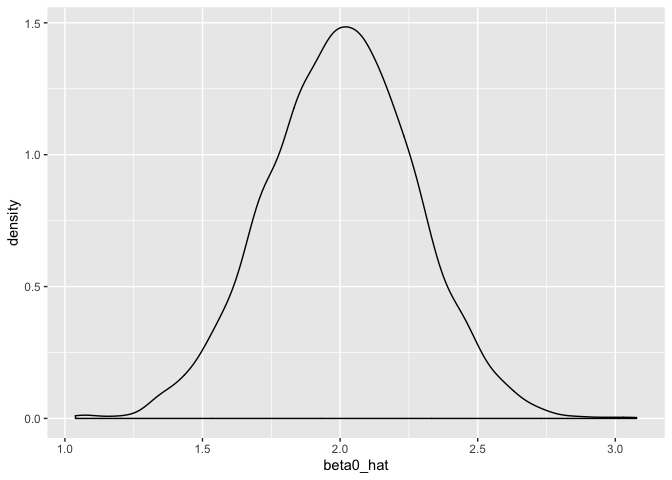
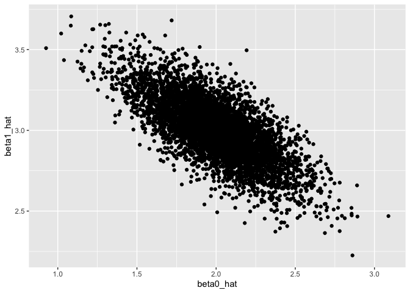
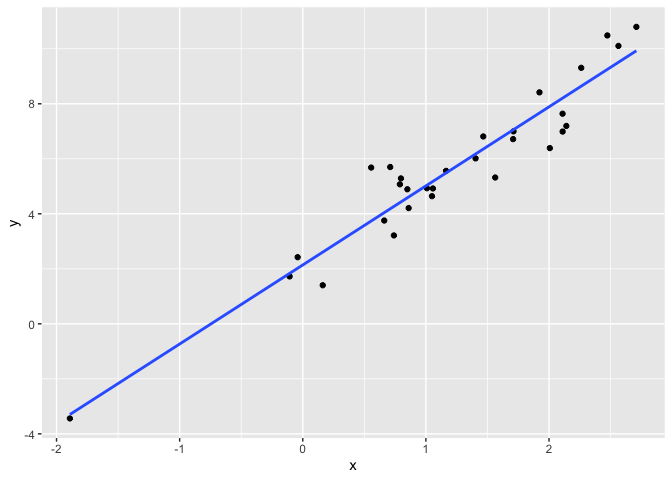

simulation
================
Yuning Wang
10/31/2019

## Simulate

Reuse the function of simple linear regression

``` r
sim_regression = function(n, beta0 = 2, beta1 = 3) {
  
  sim_data = tibble(
    x = rnorm(n, mean = 1, sd = 1),
    y = beta0 + beta1 * x + rnorm(n, 0, 1)
  )
  
  ls_fit = lm(y ~ x, data = sim_data)
  
  tibble(
    beta0_hat = coef(ls_fit)[1],
    beta1_hat = coef(ls_fit)[2]
  )
}
```

``` r
sim_regression(n = 300)
```

    ## # A tibble: 1 x 2
    ##   beta0_hat beta1_hat
    ##       <dbl>     <dbl>
    ## 1      1.96      3.03

## Rerun using a for loop

``` r
output = vector("list", length = 5000)

for(i in 1:5000){
  
  output[[i]] = sim_regression(n = 30)
  
}

bind_rows(output) %>% 
  ggplot(aes(x = beta0_hat)) +
  geom_density()
```

<!-- -->

## Rerun simulation using ‘purrr’

``` r
output = rerun(5000, sim_regression(n = 30))

bind_rows(output) %>% 
  ggplot(aes(x = beta0_hat)) +
  geom_density()
```

<!-- -->

``` r
output = rerun(5000, sim_regression(n = 30)) %>% 
  bind_rows()

output %>% 
  ggplot(aes(x = beta0_hat, y = beta1_hat)) +
  geom_point()
```

<!-- -->

what is going on here

``` r
sim_data = tibble(
    x = rnorm(30, mean = 1, sd = 1),
    y = 2 + 3 * x + rnorm(30, 0, 1)
  )

sim_data %>% 
  ggplot(aes(x = x, y = y)) +
  geom_point() +
  stat_smooth(method = "lm", se = FALSE)
```

<!-- -->

``` r
sim_results = 
  rerun(100, sim_regression(30, 2, 3)) %>% 
  bind_rows()

sim_results %>% 
  gather(key = parameter, value = estimate, beta0_hat:beta1_hat) %>% 
  group_by(parameter) %>% 
  summarize(emp_mean = mean(estimate),
            emp_var = var(estimate)) %>% 
  knitr::kable(digits = 3)
```

| parameter  | emp\_mean | emp\_var |
| :--------- | --------: | -------: |
| beta0\_hat |     2.052 |    0.089 |
| beta1\_hat |     2.980 |    0.047 |

## try another smaple size

``` r
n_list = list(
  "n_30" = 30,
  "n_60" = 60,
  "n_120" = 120,
  "n_240" = 240
)

for (i in 1:4) {
  
  output = rerun(5000, sim_regression(n = n_list[[i]])) %>% 
    bind_rows
  
}
```

``` r
simulate_n_regressions = function(n_runs = 100, n, beta0 = 2, beta1 = 3) {
  
  rerun(n_runs, sim_regression(n, beta0, beta1)) %>% 
    bind_rows()
  
}

sim_results = 
  tibble(sample_size = c(30, 60, 120, 240)) %>% 
  mutate(estimate_dfs = map(.x = sample_size, ~simulate_n_regressions(n = .x)))

sim_results = 
  tibble(
    sample_size = c(30, 60, 120, 240)
  ) %>% 
  mutate(
    output_list = map(.x = sample_size, ~rerun(1000, sim_regression(n = .x)))
  )
```
