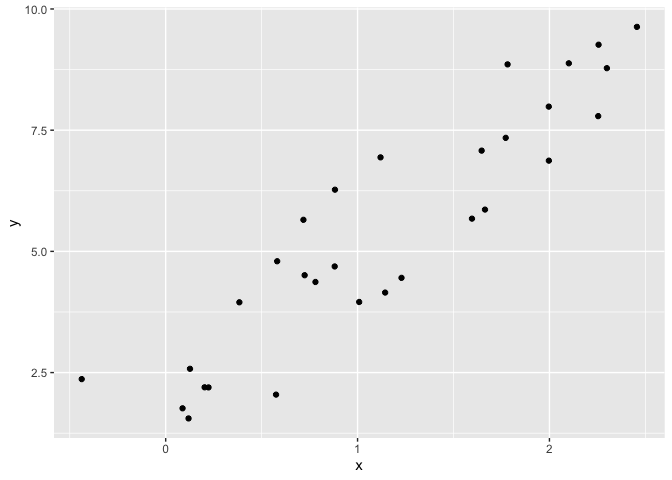

writing functions
================
Yuning Wang
10/24/2019

## Get started

write some functions

``` r
x = rnorm(n = 30, mean = 4, sd = 2.3)
x_again = rnorm(n = 30, mean = 6, sd = .3)
y = rnorm(n = 25, mean = 5, sd = 3)

(x - mean(x)) / sd(x)
```

    ##  [1] -0.767120446  0.109493425 -0.993470503  1.637039863  0.267334741
    ##  [6] -0.977065475  0.438222871  0.709719461  0.533829741 -0.419692475
    ## [11]  1.546684110  0.332624325 -0.761479160 -2.485776741  1.128069748
    ## [16] -0.137851865 -0.106748415  0.932105430  0.799422547  0.553437533
    ## [21]  0.905205442  0.757128408 -0.008541293 -2.241925304  0.581490604
    ## [26] -0.149966223 -0.257816586 -1.680744021 -0.606639531  0.363029790

``` r
(x_again - mean(x_again)) / sd(x_again)
```

    ##  [1]  1.5413954 -0.2961850  0.3204956 -0.2345965 -1.8983946 -0.6887392
    ##  [7] -0.6627062 -0.2415224  1.2161757  0.7926368 -0.3738088 -0.4855096
    ## [13]  0.7093845  0.5329776 -1.0329536 -1.0565157  0.2914637  0.7993727
    ## [19] -0.3082034  0.9409190  0.3336151 -0.9364778  0.2619634 -1.5869527
    ## [25]  1.6348722  2.3231173 -0.6286716 -1.4797904  0.5493942 -0.3367558

Now a function

``` r
z_score = function(x) {
  
  if(!is.numeric(x)){
    stop("x should be numeric")
  } else if (length(x) == 1) {
    stop("Z scores cannot be computed for length 1 vectors")
  }
  
  z = (x - mean(x)) / sd(x)
  z
}
```

Try out the function

``` r
z_score(x = y)
```

    ##  [1]  2.27000584 -0.09941700  0.60822782 -0.03414277 -0.78284574
    ##  [6]  0.12194164 -1.81345954  1.36133805  0.08744277  2.04770191
    ## [11]  0.40026771 -0.75049432  0.53152723 -0.96808544 -1.27826957
    ## [16]  0.22159127 -0.49164376 -0.06025241  0.01084022 -0.63359324
    ## [21] -0.61335130 -0.19254784  1.08228332 -1.54030301  0.51523816

``` r
z_score(x_again)
```

    ##  [1]  1.5413954 -0.2961850  0.3204956 -0.2345965 -1.8983946 -0.6887392
    ##  [7] -0.6627062 -0.2415224  1.2161757  0.7926368 -0.3738088 -0.4855096
    ## [13]  0.7093845  0.5329776 -1.0329536 -1.0565157  0.2914637  0.7993727
    ## [19] -0.3082034  0.9409190  0.3336151 -0.9364778  0.2619634 -1.5869527
    ## [25]  1.6348722  2.3231173 -0.6286716 -1.4797904  0.5493942 -0.3367558

``` r
z_score(x = 3)
```

    ## Error in z_score(x = 3): Z scores cannot be computed for length 1 vectors

``` r
z_score("my name is jeff")
```

    ## Error in z_score("my name is jeff"): x should be numeric

``` r
z_score(sample(c(TRUE, FALSE), 25, replace = TRUE))
```

    ## Error in z_score(sample(c(TRUE, FALSE), 25, replace = TRUE)): x should be numeric

``` r
z_score(c(T, T, F, F))
```

    ## Error in z_score(c(T, T, F, F)): x should be numeric

``` r
z_score(x = iris)
```

    ## Error in z_score(x = iris): x should be numeric

### Multiple outputs

``` r
mean_and_sd = function(input_x) {
  
  if (!is.numeric(input_x)) {
    stop("Argument x should be numeric")
  } else if (length(input_x) == 1) {
    stop("Cannot be computed for length 1 vectors")
  }
  
  mean_x = mean(input_x)
  sd_x = sd(input_x)

  tibble(
    mean = mean_x, 
    sd = sd_x
  )
}
```

test this function

``` r
mean_and_sd(input_x =  y)
```

    ## # A tibble: 1 x 2
    ##    mean    sd
    ##   <dbl> <dbl>
    ## 1  5.19  3.09

### Multiple Inputs

``` r
sim_data = tibble(
  x = rnorm(30, mean = 1, sd = 1),
  y = 2 + 3 * x + rnorm(30, 0, 1)
)

sim_data %>% ggplot(aes(x = x, y = y)) + geom_point()
```

<!-- -->

``` r
ls_fit = lm(y ~ x, data = sim_data)
  
beta0_hat = coef(ls_fit)[1]
beta1_hat = coef(ls_fit)[2]
```

``` r
sim_regression = function(n, beta0, beta1){
  
  sim_data = tibble(
  x = rnorm(n, mean = 1, sd = 1),
  y = beta0 + beta1 * x + rnorm(n, 0, 1)
)


ls_fit = lm(y ~ x, data = sim_data)

tibble(
  # the intercept  
  beta0_hat = coef(ls_fit)[1],
  # the slope
  beta1_hat = coef(ls_fit)[2])
}

sim_regression(n = 3000, beta0 = 17, beta1 = 3)
```

    ## # A tibble: 1 x 2
    ##   beta0_hat beta1_hat
    ##       <dbl>     <dbl>
    ## 1      17.0      2.97

``` r
sim_regression(3000, 17, 3)
```

    ## # A tibble: 1 x 2
    ##   beta0_hat beta1_hat
    ##       <dbl>     <dbl>
    ## 1      17.0      3.01

## Scrape lots of napoleon

``` r
url = "https://www.amazon.com/product-reviews/B00005JNBQ/ref=cm_cr_arp_d_viewopt_rvwer?ie=UTF8&reviewerType=avp_only_reviews&sortBy=recent&pageNumber=1"

dynamite_html = read_html(url)

review_titles = dynamite_html %>%
  html_nodes("#cm_cr-review_list .review-title") %>%
  html_text()

review_stars = dynamite_html %>%
  html_nodes("#cm_cr-review_list .review-rating") %>%
  html_text()

review_text = dynamite_html %>%
    html_nodes(".review-data:nth-child(4)") %>%
    html_text()

reviews = tibble(
  title = review_titles,
  stars = review_stars,
  text = review_text
)
```

now as a function

``` r
read_page_reviews <- function(page_url) {
  
  h = read_html(page_url)
  
  review_titles = h %>%
    html_nodes("#cm_cr-review_list .review-title") %>%
    html_text()
  
  review_stars = h %>%
    html_nodes("#cm_cr-review_list .review-rating") %>%
    html_text() %>%
    str_extract("\\d") %>%
    as.numeric()
  
  review_text = h %>%
    html_nodes(".review-data:nth-child(4)") %>%
    html_text()
  
  tibble(
    title = review_titles,
    stars = review_stars,
    text = review_text
  )
  
}
```

``` r
read_page_reviews("https://www.amazon.com/product-reviews/B00005JNBQ/ref=cm_cr_arp_d_viewopt_rvwer?ie=UTF8&reviewerType=avp_only_reviews&sortBy=recent&pageNumber=3")
```

    ## # A tibble: 10 x 3
    ##    title                                  stars text                       
    ##    <chr>                                  <dbl> <chr>                      
    ##  1 "A classic!\n            "                 5 Format: DVDVerified Purcha…
    ##  2 "A must own\n            "                 5 Format: Prime VideoVerifie…
    ##  3 "If you like 80s ...you must watch\n …     5 Format: Prime VideoVerifie…
    ##  4 "🤘\n            "                         5 Format: Prime VideoVerifie…
    ##  5 "Super Slow Mooovie...\n            "      1 Format: Prime VideoVerifie…
    ##  6 "Awesome!\n            "                   5 Format: Prime VideoVerifie…
    ##  7 "Very funny\n            "                 4 Format: Prime VideoVerifie…
    ##  8 "Eat your food tina\n            "         5 Format: Prime VideoVerifie…
    ##  9 "Dumb funny\n            "                 5 Format: DVDVerified Purcha…
    ## 10 "Annoying! Not in a good way.\n      …     1 Format: Prime VideoVerifie…
